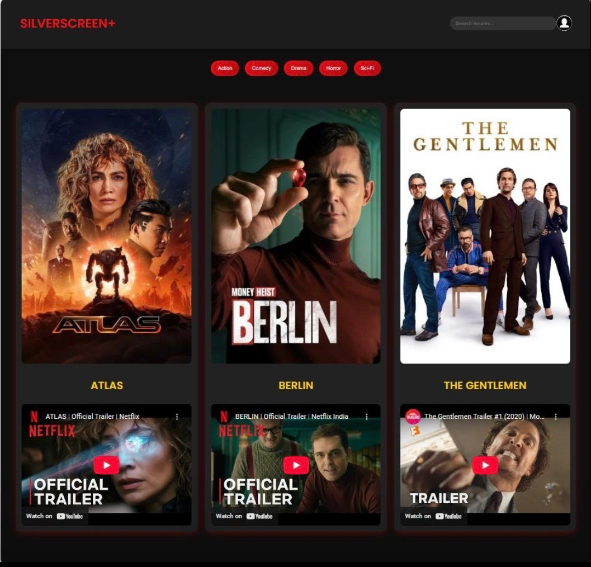

# 🎬 SILVERSCREEN+

> 🥈 **2nd Prize Winner — No Code Ninja Web Designing Competition**

SILVERSCREEN+ is an interactive movie-streaming platform interface collaboratively designed and developed by **Varsha S Panicker and Rizia Sara Prabin** for the **No Code Ninja Web Designing Competition**, where our team secured **2nd Prize**.

The project focuses on creating an engaging and visually appealing movie-browsing experience using frontend web technologies.

---

## 🏆 Achievement

### 🥈 2nd Prize — No Code Ninja Web Designing Competition

SILVERSCREEN+ was developed as part of a competitive web-design challenge with a focus on **creativity, UI/UX, visual presentation, and frontend interactivity**.

Our project secured **2nd Prize** in the competition.

---

## 🖥️ Project Preview



---

## 📌 About the Project

SILVERSCREEN+ is a frontend prototype inspired by modern movie-streaming platforms.

The application provides an interactive interface where users can browse movies, search for titles, filter content by genre, explore movie information, view cast details, and watch embedded trailers.

The project demonstrates how **HTML, CSS, and JavaScript** can be combined to create an engaging entertainment-focused web experience.

---

## ✨ Features

### 🎥 Movie Browsing

- Browse a collection of movies
- Interactive movie cards
- Movie posters and information
- Visually engaging browsing interface

### 🔍 Movie Search

- Search interface for discovering movies
- Makes navigating the available movie collection easier

### 🎭 Genre Filtering

- Filter movies based on genre
- Provides a more organized movie-discovery experience

### 🎬 Movie Details

Users can explore additional information about selected movies, including:

- Movie descriptions
- Ratings
- Cast information
- Actor images
- Trailer content

### 🪟 Interactive Movie Modal

Movie information is presented through an interactive modal, allowing users to explore additional details without leaving the main browsing interface.

### ▶️ Trailer Integration

Movie trailers are integrated into the interface using embedded YouTube content.

### ✨ Splash Screen

SILVERSCREEN+ includes an introductory splash screen that transitions users into the main movie-browsing interface.

---

## 🔄 User Experience

```text
Launch SILVERSCREEN+
        │
        ▼
   Splash Screen
        │
        ▼
   Movie Homepage
        │
        ├──── Search Movies
        │
        ├──── Filter by Genre
        │
        └──── Browse Movie Cards
                    │
                    ▼
               Select Movie
                    │
                    ▼
              Movie Details
                    │
             ┌──────┼──────┐
             ▼      ▼      ▼
          Rating   Cast   Trailer
```

---

## 🛠️ Technologies Used

### Frontend

- HTML5
- CSS3
- JavaScript

### Web Development Concepts

- Responsive Web Design
- DOM Manipulation
- Interactive UI Components
- Modal-Based Content
- Search and Filtering
- Multimedia Integration
- YouTube Embed Integration

### Development Tools

- Git
- GitHub
- Visual Studio Code

---

## 📂 Project Structure

```text
SILVERSCREEN/
│
├── assets/
│   └── Images and media assets
│
├── index.html
├── splash.html
├── settings.json
├── silverscreen-preview.png
└── README.md
```

### `splash.html`

Provides the introductory SILVERSCREEN+ splash-screen experience before users enter the main interface.

### `index.html`

Contains the primary movie-browsing interface and interactive functionality.

### `assets/`

Contains images and other visual resources used throughout the website.

---

## 🚀 Running the Project

### 1. Clone the repository

```bash
git clone https://github.com/Varsha-200/SILVERSCREEN.git
```

### 2. Enter the project directory

```bash
cd SILVERSCREEN
```

### 3. Launch SILVERSCREEN+

Open:

```text
splash.html
```

in a modern web browser.

The splash screen will transition into the main SILVERSCREEN+ interface.

---

## 👥 Team

SILVERSCREEN+ was collaboratively designed and developed by:

- **Varsha S Panicker**
- **Rizia Sara Prabin**

The project was created for the **No Code Ninja Web Designing Competition**, where our team secured **2nd Prize**.

---

## 💡 Key Learnings

Through this project, we gained practical experience in:

- Frontend web development
- HTML, CSS, and JavaScript
- UI/UX design
- Building interactive web interfaces
- Search and filtering functionality
- Designing movie-card layouts
- Modal-based content presentation
- Embedded multimedia integration
- Responsive web design
- Collaborative web development
- Working under competition constraints
- Transforming a design concept into a functional prototype

---

## 🏅 Recognition

### 🥈 2nd Prize — No Code Ninja Web Designing Competition

SILVERSCREEN+ was developed collaboratively by **Varsha S Panicker and Rizia Sara Prabin** and secured **2nd Prize** in the competition.

The project focused on combining visual design, creativity, and frontend interactivity to create an engaging movie-browsing experience.

---

## 🔮 Future Improvements

Potential enhancements include:

- User authentication
- Personalized user profiles
- Watchlists
- Movie database/API integration
- Dynamic movie recommendations
- User ratings and reviews
- Recently watched history
- Backend and database integration
- Improved mobile responsiveness
- Accessibility improvements
- Cloud deployment

---

## ⚠️ Project Scope

SILVERSCREEN+ was developed as a **web-design competition prototype**.

The project demonstrates the design and frontend experience of a movie-streaming platform and does not provide actual movie-streaming services.

---

## 📄 Disclaimer

SILVERSCREEN+ was developed for educational and competition purposes.

Movie names, posters, trailers, actor images, and related media belong to their respective copyright holders. This project is not affiliated with or endorsed by the featured films, studios, actors, or streaming platforms.
